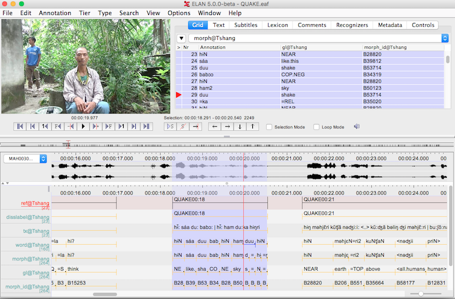

# org2eaf (Work in progress...)
Python script for conversion of emacs org-mode files to ELAN .eaf XML.

## Introduction
This is a part of a playful attempt without master plan of keeping
linguistic fieldwork data in [org-mode][] plain text. Why would anyone
do this? Possible reasons are: 1) for not having to leave emacs for
doing linguistics 2) for not having to buy Windows for installing FLEX
3) for not getting lost in dropdown menus 4) for writing own functions
for the things I want to do 5) for making direct links to the corpus
from anywhere within emacs 6) for having the data in a human readable
format which can be opened with any text editor on any operating
system for ever :-)

The [ELAN][] software developed by The Language Archive (MPI) displays
annotation data in the .eaf format (ELAN Annotation Format). This
script converts org-mode files into .eaf XML which can be viewed in
ELAN.

[org-mode]: http://orgmode.org/
[ELAN]: https://tla.mpi.nl/tools/tla-tools/elan/

# Minitutorial for converting a file
1) Have Python3 and pip3 installed.
2) Download the ‘subgrouping-kho-bwa’ directory from Github by clicking on the green button `Clone or download`, unzip (alternatively clone the directory)
3) Open a terminal/shell and navigate to the folder (e.g. `cd ~/Downloads/org2eaf`)
4) install the script
``` bash
pip3 install --editable .
```

5) navigate to the example folder
```bash
cd example
```

6) make .eaf file from .org file

``` bash
org2eaf QUAKE.org my-QUAKE.eaf
```

7) Open the eaf file in ELAN (if ELAN is already installed)

``` bash
open my-QUAKE.eaf
```



# Technical stuff
## Structure of org-mode files
There is one org-mode file per recording. Some org-mode files contain
more than one story. All text between ##BEGIN##STORY1 and ##END##STORY1
is the text belonging to STORY1

The metadata about the recording. Crucial for the conversion to .eaf
XML is that there is an associated media file `:AUDIO:` or
`:VIDEO:`. The files start with something like this.

```Org
* FileMetadata
:PROPERTIES:
:AUDIO: Puroik_0313.wav (Name of audio recording)
:VIDEO: None (Name of video recording)
:LENGTH: 00:07:03 (length of recording)
:LOCATION: Tezpur (location of recording)
:DATE: 2014-11-23 (date of recording)
:SPEAKER: P Raiju (speaker)
:AUTHOR: Ismael Lieberherr ()
:END:
```

Following are the data fields:

```Org
** Transcription
[MB] phonological with morpheme boundaries (-=)
[GL] English glosses with morpheme boundaries (-=)
[FT] Free english translation
[RC] Recording
*** METADATA
:PROPERTIES:
:KEYS: Key of morpheme in the dictionary
:SPEAKER: Speaker of the text unit
:LABEL: reference label of text unit, consists of story name and time code, used
        for links e.g. within emacs
:TC: time code
:COM: comments about the text unit (public)
:END:
```


Example:

```Org
** DONE kũ ɬɨŋla
[MB]  kuN  ɬɨŋ=la
[GL]  UP   climb=SEQ
[FT] He climbed up.
[RC] [[file:./Puroik_0313.wav::00:02:31]]
*** METADATA
:PROPERTIES:
:KEYS: B36302 B33713=B34996
:SPEAKER: P
:LABEL: <<FROG02:31>>
:TC: 00:02:31.184-00:02:32.042
:Q:
:COM:
:END:
```

## Structure of the .eaf file

ELAN .eaf files are XML files with roughly following structure:

```xml
<ANNOTATION_DOCUMENT>
   <HEADER>
   </HEADER>
   <TIME_ORDER>
     <TIME_SLOT/>
     <TIME_SLOT/>
     ...
   </TIME_ORDER>
   <TIER>
     <ANNOTATION>
     </ANNOTATION>
     <ANNOTATION>
     </ANNOTATION>
     ...
   </TIER>
   <LINGUISTIC_TYPE/>
   <LINGUISTIC_TYPE/>
   ...
   <LOCALE/>
   <CONSTRAINT/>
   <CONSTRAINT/>
   ...
<ANNOTATION_DOCUMENT>
```

i.e. the ANNOTATION_DOCUMENT has 6 different childs. There is exactly
one child `<HEADER>` and one `<TIME_ORDER>`. Of other child elements
there can be more than one.

- `<HEADER>` with XML stuff for ELAN (only one)
- `<TIME_ORDER>` a list of all time points in the file
- `<TIER>` tiers contain the actual linguistic data
- `<LINGUISTIC_TYPE>` properties of tiers
- `<LOCALE>` language and country of computer
- `<CONSTRAINT>` constraints used to describe how tiers relate to each
  other or to the time line

## Tiers in the .eaf file
For every speaker in a text there is a set of nine tiers:
1) `ref@Speaker`
2) `disslabel@Speaker`
3) `tx@Speaker`
4) `word@Speaker`
5) `morph@Speaker`
6) `gl@Speaker`
7) `morph_id@Speaker`
8) `ft@Speaker`
9) `com@Speaker`
